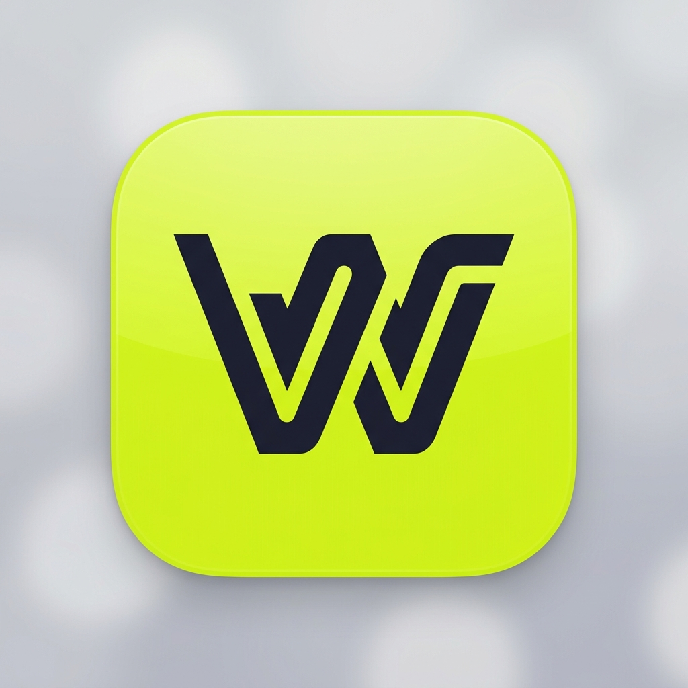

<div align="center">
  

  <h1>WorkoutSplit</h1>

  <p><strong>Track every lift. Chase every PR. Built for the gym floor.</strong></p>

  <p>
    
    
    
    
    
    
  </p>

  <p>
    <a href="https://workoutsplit.netlify.app">🚀 Live Demo</a> ·
    <a href="https://github.com/Kartikkittad/WorkoutSplit/issues">🐛 Report Bug</a> ·
    <a href="https://github.com/Kartikkittad/WorkoutSplit/issues">💡 Request Feature</a>
  </p>
</div>

## The Problem

Every gym-goer knows the pain: fitness apps that demand expensive monthly subscriptions, harvest personal data, require account creation, bombard you with ads between sets, and weigh in at hundreds of megabytes. On the other hand, logging workouts in a plain Notes app is tedious, manual, and does not calculate progressive overload or track personal records automatically.

## The Solution

**WorkoutSplit** is a free, open-source, privacy-first, offline-first Progressive Web App (PWA) designed to do one thing exceptionally well: **track your workouts**. There are no accounts, no cloud dependencies, and zero ads. The entire application is under 1MB, installs directly to your phone's home screen, and works fully offline in areas of the gym with poor or no cellular reception.

## Who is this for

- **Serious lifters** who want a fast, distraction-free logging tool on the gym floor.
- **Privacy-conscious athletes** who want all of their personal training logs to stay securely on their own device.
- **Gym-goers in poor signal areas** who need reliable offline functionality.
- **Training partners** who want to leverage the built-in Buddy Mode to log workouts together.

## How it works

WorkoutSplit uses Dexie.js to store all your data locally in your browser's IndexedDB. Everything runs client-side inside your browser sandbox. When you construct a split or log a session, the data stays on your device. You can track progress, view interactive charts, or export history to CSV without ever making network requests. If you use Buddy Mode, the app logs sets for both you and your partner side-by-side, saving individual sessions under separate profiles.

## Features

### 🏋️ Core Tracking

- **Workout Split Builder**: Design custom workout routines (Push/Pull/Legs, Upper/Lower, or custom days) and set active splits.
- **Gym-Friendly Logger**: Quick set logging with smooth input sheets designed for one-handed operation on the gym floor.
- **Auto Rest Timer**: Floating timer with circular SVG countdown and vibration alerts when your rest finishes.
- **Plate Calculator**: Tells you exactly what plates to load on the barbell for any given weight target.

### 📈 Progressive Overload

- **Target Calibration**: Automatically suggests weight and reps based on your last logged session (e.g. `Last: 60kg × 8 · Target: 62.5kg × 8`).
- **Real-Time PR Detection**: Alerts you with a fullscreen celebration overlay when you hit a new personal record.
- **Shareable PR Cards**: Generate shareable images built for Instagram and WhatsApp stories.

### 📊 Analytics

- **Custom SVG Analytics**: High-performance interactive line charts showing Max Weight, Volume, and total sets over time.
- **Body Visualizer & Heatmap**: 3D body visualizer and heatmap to track training frequency and muscle group activation.
- **Calories Burned Estimation**: MET-based calculation tailored to your body weight and gender.

### 📋 Management

- **Workout Templates**: Save completed workouts as templates to load in a single tap later.
- **Export/Import**: Full export to CSV so you retain complete ownership of your data.

## Tech Stack

| Layer            | Technology              | Purpose                            |
| ---------------- | ----------------------- | ---------------------------------- |
| **Framework**    | Next.js 16 (App Router) | Core React-based app framework     |
| **Language**     | TypeScript 5            | Safe, type-safe development        |
| **Styling**      | Vanilla CSS             | Fast, lightweight UI styling       |
| **Storage**      | Dexie.js (IndexedDB)    | Client-side offline local database |
| **3D Rendering** | Three.js                | Interactive 3D body visualizer     |
| **Canvas**       | HTML2Canvas             | PR card image generation           |

## Getting Started

### Prerequisites

- Node.js 18+
- npm or yarn

### Installation

1. Clone the repository:
   ```bash
   git clone https://github.com/yourusername/workoutsplit.git
   cd workoutsplit
   ```
2. Install dependencies:
   ```bash
   npm install
   ```
3. Run the development server:
   ```bash
   npm run dev
   ```
4. Open the application in your browser:
   [http://localhost:3000](http://localhost:3000)

### Build for Production

```bash
npm run build
npm start
```

## Project Structure

```text
workoutsplit/
├── src/
│   ├── app/                # Next.js App Router pages
│   │   ├── page.tsx        # Dashboard
│   │   ├── create/         # Split builder
│   │   ├── history/        # History page
│   │   ├── log/            # Active logger
│   │   ├── progress/       # Analytics & charts
│   │   └── settings/       # Settings page
│   ├── components/         # Reusable React components
│   │   ├── BodyVisualizer3D.tsx
│   │   ├── LineChart.tsx
│   │   └── RestTimer.tsx
│   └── lib/                # Core logic & database
│       ├── dexie.ts        # IndexedDB setup
│       ├── storage.ts      # Data helper methods
│       └── seed.ts         # Database initialization
└── public/                 # Static assets & PWA files
    └── sw.js               # Service worker for offline use
```

## Roadmap

### v1.0.2 (Current Release)

- [x] Workout split builder & template loader
- [x] Gym-friendly log sheet
- [x] Live rest timer with vibrations
- [x] Real-time PR detection
- [x] Streak tracking & milestones
- [x] Buddy Mode session logging
- [x] Calories burned dashboard
- [x] Offline PWA capabilities

### v2.0.0 (Upcoming)

- [ ] Cloud sync backup via Supabase
- [ ] Real-time local Bluetooth sync with training buddy
- [ ] Apple Health & Google Fit connections
- [ ] Smart progression analytics with AI-driven suggestions

## Contributing

Contributions are always welcome! If you want to contribute:

1. Fork this repository.
2. Create a feature branch (`git checkout -b feature/AmazingFeature`).
3. Commit your changes (`git commit -m 'feat: Add some AmazingFeature'`).
4. Push to the branch (`git push origin feature/AmazingFeature`).
5. Open a Pull Request.

## License

Distributed under the MIT License. See [LICENSE](LICENSE) for details.

<div align="center">
  <p>Built with 💪 by Kartik Kittad</p>
  <p>If you find this project helpful, please consider leaving a ⭐ on GitHub!</p>
</div>
